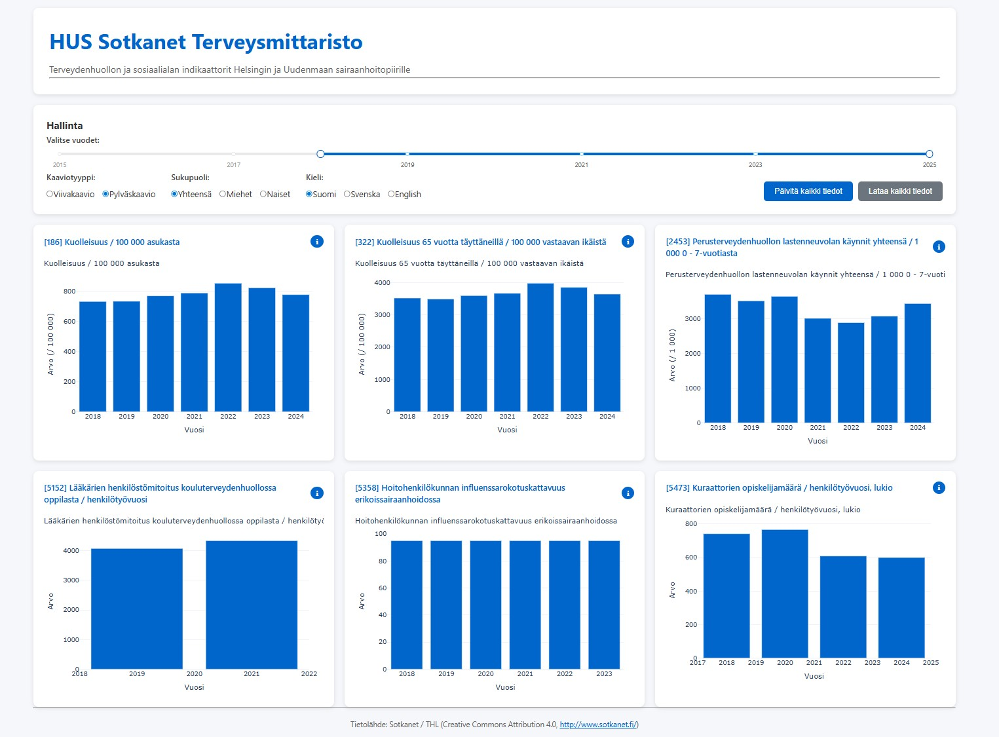

# HUS Sotkanet Health Dashboard

A web-based dashboard for visualizing health and social indicators for the Hospital District of Helsinki and Uusimaa (HUS) region using data from the Sotkanet API.



## Assumptions and decisions

The basic assumption in this solution has been an use case where a customer wants to have a dashboard visualizing different indicators in Sotkanet but is not able to set the requirements for the development work. Thus, the objective has been to develop a MVP that fulfills potentially the basic requirements. This application would make a lot easier for the customer to define (final) requirements since the application gives some hints what is possible and also how the dashboard could look like.

The application is built by using Dash. The clear benefits of using Dash is the quick development, single programming language (python), simple environment and fairly minimal CSS configurations. For heavy and critical web apps Dash won't be the correct solution. Even in testing phase Gunicorn or some other WSGI server could be considered.

The application had finally more features than expected and also the time spent for the application was more than the estimated 3-5 hours. The development work was a little bit on-and-off and totally I spent maybe 7-8 hours for the development and documentation. The development environment was VSCode in Windows laptop. GitHub copilot was used for some minor corrections but in project planning, coding and documentation Claude 4.0/4.1 was used heavily. During the last 1-2 years my coding style has changed quite a bit due to coding agents. 

The application is lacking a proper testing - now the application has only basic error handling implemented. Also, with default settings the application can be accessed only from the local computer (there are instructions how to start the applications in such way that it can be accessed from other clients as well). The application has been tested only in Windows. However, e.g. requirements.txt has been checked and there should not be Windows specific packages in use.

## Features

- **Multi-language Support**: Available in Finnish, Swedish, and English
- **Interactive Visualizations**: Line and bar charts for indicator trends
- **Real-time Data**: Fetches latest data from Sotkanet REST API
- **Responsive Design**: Works on desktop and mobile devices
- **Data Export**: Download all displayed data as CSV
- **Caching**: Smart caching to reduce API calls and improve performance
- **Gender Filtering**: View data by total, male, or female populations

## Technologies Used

### Core Technologies
- **Python 3.8+**: Main programming language for backend logic
- **Dash 3.2.0**: Web framework for building interactive dashboards
  - Chosen for its excellent Python integration and interactive visualization capabilities
  - Provides reactive programming model perfect for data dashboards
- **Plotly 6.3.0**: Interactive charting library
  - Native integration with Dash
  - Supports responsive, interactive charts with minimal code
- **Pandas 2.3.2**: Data manipulation and analysis
  - Industry standard for data processing in Python
  - Efficient handling of time series data

### Additional Libraries
- **Requests**: For API calls to Sotkanet REST API
- **Python-dotenv**: Environment configuration management
- **Flask**: Web server (used internally by Dash)

### Why These Technologies?
- **Python ecosystem**: Excellent for data processing and visualization
- **Dash + Plotly**: Provides production-ready interactive dashboards without JavaScript
- **No database required**: Direct API integration keeps the architecture simple
- **Responsive by default**: Dash components are mobile-friendly out of the box

## Prerequisites

- Python 3.8 or higher
- pip (Python package installer)
- Internet connection (for fetching data from Sotkanet API)

## Installation

1. **Extract the ZIP file**
   ```bash
   # Extract the provided hus-sotkanet-main.zip file to your desired location
   # For example on Windows: right-click and "Extract All..."
   # On macOS/Linux: unzip hus-sotkanet-main.zip
   
   # Navigate to the extracted directory
   cd hus-sotkanet-main
   ```

2. **Create a virtual environment**
   ```bash
   python -m venv .venv
   ```

3. **Activate the virtual environment**
   - Windows:
     ```bash
     .venv\Scripts\activate
     ```
   - macOS/Linux:
     ```bash
     source .venv/bin/activate
     ```

4. **Install dependencies**
   ```bash
   pip install -r requirements.txt
   ```

5. **Configure environment** (optional)
   
   The application comes with a `.env` file with default settings. You can modify it if needed:
   ```env
   APP_ENV=production  # Options: development, production, testing
   CACHE_ENABLED=true
   CACHE_TTL=3600
   LOG_LEVEL=INFO
   ```

## Usage

### Running the Dashboard

1. **Start the application**
   ```bash
   python app.py
   ```
   
   Or with custom settings:
   ```bash
   python app.py --port 8050 --host 127.0.0.1 --debug
   ```

   To access the application from other clients:
   ```bash
   python app.py --port 8050 --host 0.0.0.0
   ```   

2. **Open in browser**
   
   Navigate to `http://127.0.0.1:8050` in your web browser

### Using the Dashboard

- **Select Years**: Use the range slider to choose the time period
- **Chart Type**: Toggle between line and bar charts
- **Gender Filter**: View data for total population, males, or females
- **Language**: Switch between Finnish, Swedish, and English
- **Info Button (ℹ)**: Click to see metadata for each indicator
- **Refresh Data**: Click to fetch latest data from Sotkanet
- **Download Data**: Export all displayed data as CSV

## Health Indicators Used

The dashboard displays the following health and social indicators (production environment):

1. **186** - Mortality per 100,000 inhabitants (Kuolleisuus / 100 000 asukasta)
2. **322** - Mortality among population aged 65+ per 100,000 (Kuolleisuus 65 vuotta täyttäneillä)
3. **5358** - Influenza vaccination coverage for health care professionals
4. **5473** - Number of students that each school social worker is responsible for 
5. **5152** - Physicians' staffing ratio in school health care
6. **2453** - Child-health-clinic visits in primary health care

### Indicator Selection Rationale
- Indicators were selected to test different datasets in the Sotkanet
- Focus on mortality and health behavior metrics
- All indicators have data available for the HUS region (ID: 629)
- Data covers years 2020-2024 by default

### Environment-Specific Configurations
- **Development**: Uses 3 core indicators for faster testing
- **Production**: Uses all 6 indicators for comprehensive analysis
- **Testing**: Uses 1 indicator for unit tests

## Limitations and Assumptions

### Assumptions
- Internet connection is required for fetching data from Sotkanet API
- Data is available for the HUS region (ID: 629) for selected indicators
- API response times are reasonable (timeout set to 30 seconds)
- Browser supports modern JavaScript for interactive charts

### Limitations
- **Data Availability**: Some indicators may not have data for all requested years
- **API Rate Limits**: Sotkanet API may have rate limiting (handled with retry logic)
- **Region-Specific**: Dashboard is configured specifically for HUS region
- **Real-time Updates**: Data is cached for 1 hour to reduce API load

### Error Handling
- **API Failures**: Automatic retry with exponential backoff (3 attempts)
- **Missing Data**: Gracefully handles missing data with informative messages
- **Network Issues**: Displays user-friendly error messages
- **Caching**: Falls back to cached data when API is unavailable
- **Logging**: Comprehensive logging to `logs/` directory for debugging
- **Data Validation**: Automatic validation of data availability on startup

## Project Structure

```
hus-sotkanet-dashboard/
├── api/                 # Sotkanet API client
├── assets/             # CSS styles
├── config/             # Configuration and settings
├── dashboard/          # Dashboard layout and callbacks
├── data/               # Data fetching and processing
├── logs/               # Application logs
├── utils/              # Logging and utilities
├── app.py              # Main application
├── requirements.txt    # Python dependencies
└── .env               # Environment configuration
```


## Configuration

### Region
Default region is HUS (Hospital District of Helsinki and Uusimaa, ID: 629). This can be changed in `config/settings.py`.

### Customizing Indicators
Modify `config/settings.py` to customize indicator sets for different environments.

## Data Source

**Tietolähde: Sotkanet / THL (Creative Commons Attribution 4.0, http://www.sotkanet.fi/)**

All health and social indicator data is sourced from [Sotkanet](http://www.sotkanet.fi/), provided by THL (Finnish Institute for Health and Welfare) under Creative Commons Attribution 4.0 license.

The application fetches data in real-time from the Sotkanet REST API and displays it with proper attribution in the dashboard footer.

## Troubleshooting

- **No data displayed**: Check logs in `logs/app.log` for API errors
- **Slow performance**: Ensure caching is enabled in `.env`
- **Connection errors**: Verify internet connection and Sotkanet API availability
- **Missing indicators**: Some indicators may not have data for all years - check metadata with `python scripts/fetch_metadata.py --validate`

## Development

### Environment Setup
```bash
# Set development environment
export APP_ENV=development  # Linux/macOS
set APP_ENV=development     # Windows
```

### Clear Cache
```python
from data.fetcher import SotkanetDataFetcher
fetcher = SotkanetDataFetcher()
fetcher.clear_cache()
```

## License

TBD

## Contact
Matti Manninen
+358 50 362 7724
matti.manninen@gwlnetworks.com